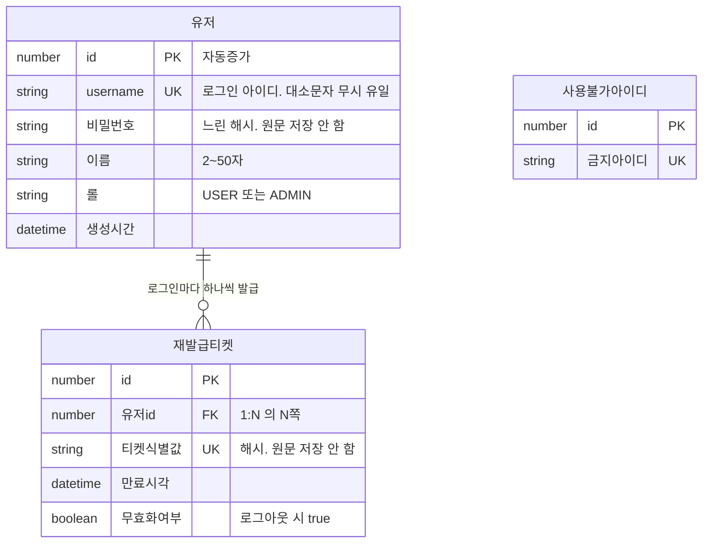

# 데이터 모델 — 논리 설계

> **프로세스 3.5.** constitution 원칙 III — **DB 논리 설계는 사람이 직접 작성하고 AI는 리뷰만 한다.**
> 스키마는 이 프로젝트에서 되돌리기 비용이 가장 높은 결정이다. 코드는 틀리면 다시 쓰면 되지만
> 스키마는 이미 운영 데이터가 들어 있는 상태에서 바꿔야 한다.

**범위**: 논리 설계만 — 엔터티 · 관계 · 정규화. DBMS·ORM과 무관하다.
컬럼 타입 · 인덱스 · 제약 문법 같은 **물리 설계는 4번 계획**에서 다룬다.

**누적 문서**: 스토리마다 이어 붙인다. 아래는 001 인증 분량.

---

## 판단 도구 3개

그리다 막히면 이 세 질문으로 돌아온다.

### 도구 1 — "이 둘은 같은 개념인가?"

같은 개념이면 **한 테이블 + 구분 컬럼**. 다른 개념이면 **별 테이블**.

| | 판단 |
|---|---|
| 관리자와 사용자 | 둘 다 **"로그인하는 사람"**. 같은 개념의 다른 역할 → 한 테이블 + `role` |
| 게시글과 첨부파일 | 다른 개념 → 별 테이블 |

정규화는 "많이 쪼개기"가 아니라 **"개념 단위로 정확히 자르기"** 다.
쪼개야 할 것을 붙여두면 조회·수정이 안 되고, 붙여야 할 것을 쪼개면 유일성을 DB가 보장할 수 없다.

### 도구 2 — 카디널리티는 양방향으로 묻는다

```
A 하나가  →  B 몇 개를 가지나?
B 하나가  →  A 몇 개에 속하나?
```

| 답 | 관계 | 결과 |
|---|---|---|
| 1 ↔ 1 | 1:1 | 한쪽에 FK |
| 여러 개 ↔ 1 | **1:N** | **N쪽에 FK** |
| 여러 개 ↔ 여러 개 | N:M | **중간 테이블이 필요해진다** |

**이 답은 대개 스펙에 이미 있다.** 없으면 스펙이 덜 정해진 것이다.

### 도구 3 — "한 컬럼에 값이 여러 개 들어가는가?"

들어간다면 쪼갠다. 콤마 구분 문자열(`"tag1,tag2,tag3"`)로 두면
**그중 하나만 조회·수정·삭제하는 것이 불가능**해지고, 코드에서 문자열을 파싱해 때우기 시작한다.

---

## 001에서 필요한 것 — 스펙 근거

스펙 34개 요구사항을 다시 훑는 것은 학습이 아니라 노동이므로 정리해 둔다.
**"무엇이 필요한가"는 아래에 있고, "어떻게 배치하는가"가 당신 몫이다.**

### 로그인하는 사람

| 필요한 것 | 스펙 근거 | 설계에 주는 제약 |
|---|---|---|
| 로그인 아이디 | `FR-003` 4자 이상 12자 미만, 영문·숫자 포함, `-`·`_` 외 특수문자 불가 | |
| 아이디 중복 불가 | `FR-005`, `AC-10` | **DB가 보장해야 한다.** 코드로 막으면 동시 요청에서 깨진다 |
| 아이디 대소문자 무시 | Assumptions 2 — `User01`과 `user01`은 같은 계정 | 유일성 판정에 영향을 준다 |
| 아이디 변경 불가 | Assumptions 5 | |
| 비밀번호 | `FR-008` 되돌릴 수 없는 느린 해시, `AC-9` 평문 저장 금지 | 원문을 저장하지 않는다 |
| 이름 | `FR-029` 2자 이상 50자 이하 | |
| 권한 | `FR-017` `USER` / `ADMIN`. 한 사람이 하나만 가진다 | |
| 생성 시각 | Key Entities | |

### 재발급 티켓 (Refresh 자격증명)

| 필요한 것 | 스펙 근거 | 설계에 주는 제약 |
|---|---|---|
| 누구 것인지 | `FR-014` **개별 무효화가 가능해야 한다** | |
| 만료 시각 | `FR-012` 만료 필수 | |
| 무효화 여부 | `FR-015` 로그아웃 시 무효화, `AC-5` | |
| 여러 기기 동시 로그인 | Assumptions 3 | **카디널리티를 결정한다** |
| 로그아웃은 요청한 기기만 | Assumptions 4 | 하나만 지울 수 있어야 한다 |
| 관리자 수명이 더 짧다 | `FR-033`, `AC-33` | 수명을 어디서 알아내는가? ← 판단 지점 |

### 사용불가 아이디

| 필요한 것 | 스펙 근거 |
|---|---|
| 가입 거부 목록 | `FR-004`, `AC-13` |
| **코드가 아니라 데이터로** 관리 | `FR-028` |
| 관리 화면은 004 | `FR-028` — 001에서는 초기 목록을 마이그레이션으로 |

### 남용 방어 — ⚠️ 여기에 판단이 필요하다

| 필요한 것 | 스펙 근거 |
|---|---|
| 인증 실패가 반복될수록 응답 지연 | `FR-027`, `AC-29` |
| 중복확인 빈도 제한 | `FR-030`, `AC-30` |

**"실패가 반복될수록"을 판정하려면 실패 횟수를 어딘가 기억해야 한다.** 어디에 둘 것인가가
설계 판단이고, 스펙은 그것을 정해주지 않는다.

---

## ★ TODO(human) 1 — 테이블과 컬럼

아래 표를 채운다. **컬럼 타입은 쓰지 않는다**(물리 설계는 4번 계획). 필요한 것은:

- **컬럼 이름**
- **필수 여부** (값이 반드시 있어야 하는가)
- **유일 여부** (중복이 허용되는가)
- **왜 필요한가** — 위 스펙 근거 중 어느 것인지

<!--
채우는 방법
  1. 위 "001에서 필요한 것"의 각 줄이 어느 테이블의 어느 컬럼이 되는지 배치한다
  2. 배치할 곳이 없는 항목이 나오면 그것이 새 테이블 후보다
  3. 도구 1로 검사한다 — 한 테이블에 두 개념이 섞이지 않았는가

먼저 답해야 할 것 (테이블 전체에 영향을 준다)
  ▸ 네이밍 충돌: 원 요구사항의 "아이디"는 로그인용 아이디인데,
    DB 관례상 기본키 컬럼도 `id`라고 부른다. 둘을 어떻게 구분할 것인가?
    이 결정은 테이블 3~4개 전체와, 앞으로 만들 모든 테이블에 적용된다.

  ▸ 테이블이 몇 개인가? 스펙의 엔터티는 3개지만 "남용 방어" 항목을
    배치하다 보면 답이 달라질 수 있다. 도구 1로 판단한다.
-->

> 아래는 **사람이 구술한 설계를 Claude가 옮겨 적은 것**이다.
> 구술하지 않은 항목은 `미정`으로 두고 채우지 않는다 — 조용히 메꾸면 설계의 주인이 흐려진다.

### 프로젝트 전역 규칙 — 기본키와 네이밍

001에서 정했고 **앞으로 만들 모든 테이블에 적용된다.**

| | 결정 | 근거 |
|---|---|---|
| 기본키 | **자동증가 숫자 `id`** (로그인 아이디를 PK로 쓰지 않는다) | 다른 테이블이 참조할 때 문자열이 복제되지 않는다. 로그인 아이디 정책이 바뀌어도 참조에 영향이 없다. 자바/스프링 생태계(JPA `@Id @GeneratedValue`)가 이 방식을 전제로 한다 |
| 로그인 아이디 컬럼명 | **`username`** | Spring Security가 이미 이 이름을 쓴다(`UserDetails.getUsername()`). 프레임워크와 이름이 어긋나지 않는다 |

> **화면 용어와 컬럼 이름이 다르다.** 화면에는 "아이디"로 표시되지만 컬럼은 `username`이다.
> 흔한 일이며 문제되지 않는다.

### 테이블: 유저

**판단 근거 (구술)**: 관리자를 별도 테이블로 두지 않고 `role`에 관리자를 추가해
이 테이블로 들어오게 한다. → 도구 1 적용(둘 다 "로그인하는 사람" = 같은 개념)

| 컬럼 | 필수 | 유일 | 근거 |
|---|---|---|---|
| `id` | ✅ | ✅ (PK) | 전역 규칙 |
| `username` | ✅ | ✅ | `FR-003` 형식 · `FR-005` 중복 거부 — **DB 제약으로 막는다** |
| 비밀번호 | ✅ | — | `FR-008` 되돌릴 수 없는 느린 해시 |
| 이름 | ✅ | — | `FR-029` 2~50자 |
| 롤 | ✅ | — | `FR-017` `USER` / `ADMIN` |
| 생성시간 | ✅ | — | Key Entities |

**사람이 확정한 것**

- 기본키는 숫자 별도 · 컬럼명 `username` · 유일 제약 있음 *(구술 2026-07-27)*
- **모든 컬럼 필수(NOT NULL).** 가입 시 모든 항목을 입력받으므로(`FR-001`) *(확정 2026-07-28)*

**논리 제약 (구현 방법은 4번 계획)**

- **`username`의 유일성은 대소문자를 구분하지 않는다.** `User01`과 `user01`은 같은 계정
  (Assumptions 2). *소문자로 정규화해 저장할지, DB 콜레이션에 맡길지는 물리 설계이므로
  4번 계획에서 정한다 — 논리 설계에서는 "대소문자 무시 유일" 이라는 제약만 명시한다.*
- **`username`은 가입 후 변경할 수 없다(불변).** Assumptions 5.
  *(codex 검증에서 지적 — 근거 표에만 있고 제약으로 확정되지 않았던 항목. 확정 2026-07-28)*

### 테이블: 재발급 티켓 (Refresh)

**왜 테이블인가 (구술 확인)**: 로그인마다 티켓이 하나 생기고, 로그아웃할 때 **그 티켓만**
지워야 한다 → 여러 개가 생기고 하나씩 지워야 하는 목록 = 테이블.

**왜 DB인가**: 사라지면 각 사용자의 Access 만료 시점에 재발급이 거절되어 순차적으로 전원
로그아웃된다. **서버를 재시작할 때마다(= 배포할 때마다) 그 일이 벌어진다.**
메모리 저장이 안 되는 이유가 이것이다.

| 컬럼 | 필수 | 유일 | 근거 |
|---|---|---|---|
| `id` | ✅ | ✅ (PK) | 전역 규칙 |
| 유저 참조 (FK) | ✅ | — | `FR-014` 누구 것인지 |
| 티켓을 식별하는 값 | ✅ | ✅ | 재발급 요청이 이 티켓인지 판정 |
| 만료 시각 | ✅ | — | `FR-012` 만료 필수 |
| 무효화 여부 | ✅ | — | `FR-015` 로그아웃 시 무효화, `AC-5` |

**논리 제약**

- **티켓 식별 값을 원문 그대로 저장하지 않는다.** DB가 유출되면 그 값으로 남의 계정에
  그대로 접속할 수 있다 — **비밀번호와 같은 성질**이므로 해시해서 저장한다.
- Access 토큰은 **저장하지 않는다.** 무상태이며 서명만 검증한다.
- 티켓 식별 값의 **형태**(JWT / 랜덤 문자열)는 4번 계획에서 정한다.
  Refresh는 어차피 DB를 확인하므로 JWT일 필요가 없다 — 실무에서 랜덤 문자열로 두는 경우가 많다.

**"기기마다 하나"가 아니라 "로그인마다 하나"다** *(codex 권고 반영)*

이 모델이 보장하는 것은 **로그인 1회 = 티켓 1개**뿐이다. 같은 기기에서 두 번 로그인하면
티켓이 두 개 생기고, 모델은 그 둘을 구분하지 못한다.

**어느 기기인지는 저장하지 않는다.** 스펙에 그런 요구가 없고 `로그인 이력 조회`는
Out of Scope다. 티켓이 여러 개 생긴다는 사실만 중요하다.

→ 진짜 기기 단위 종료(예: "이 기기에서 로그아웃")가 필요해지면 **별도 요구사항**으로
스펙에 추가해야 한다. 지금 모델로는 할 수 없다.

**4번 계획으로 넘기는 운영 과제**

- 만료된 티켓 행이 계속 쌓인다. DB에는 TTL(자동 삭제)이 없으므로 **주기적으로 지우는 작업이
  필요하다.** 테이블을 만들면 청소 책임이 따라온다.
- **유저가 삭제되면 그의 티켓을 어떻게 하는가.** 회원 탈퇴가 001 범위 밖이라 당장 발생하지
  않지만, 외래키 삭제 규칙은 물리 설계이므로 4번 계획에서 정한다.

### 테이블: 사용불가 아이디

**왜 코드가 아니라 테이블인가**: `FR-028`. 004에서 관리 화면을 붙이려면 데이터여야 한다.
코드에 박으면 운영자가 화면에서 바꿀 수 없고, 목록이 늘 때마다 배포해야 한다.
유저 테이블에 넣을 수도 없다 — **가입하지 않은 아이디**라서 유저 행이 존재하지 않는다.

| 컬럼 | 필수 | 유일 | 근거 |
|---|---|---|---|
| `id` | ✅ | ✅ (PK) | 전역 규칙 |
| 금지 아이디 | ✅ | ✅ **대소문자 무시** | `FR-004`, `AC-13` |

컬럼 하나짜리 테이블이며 정상이다. 값 목록만 담는 테이블은 흔하다.
초기 목록은 마이그레이션으로 제공한다(예약어는 비밀이 아니므로 커밋해도 안전).

**논리 제약 — 금지 여부 판정도 대소문자를 무시한다** *(확정 2026-07-28)*

`admin`이 목록에 있으면 `Admin` · `ADMIN` · `AdMiN` 도 모두 가입이 거부되어야 한다.

> **codex 검증에서 지적된 실제 구멍이었다.** `username`에만 대소문자 무시를 걸고
> 금지 목록에는 걸지 않아서, **`admin`이 금지여도 `Admin`으로 가입하면 통과**했다.
> `AC-13`을 대문자 하나로 우회할 수 있었다.

금지 목록의 목적이 **사칭 방지**이므로, 대문자 하나로 우회되면 목록 자체가 무의미해진다.
`username`의 대소문자 무시 정책과 같은 규칙을 적용하는 것이 일관된다.

### 논리 모델에 들어가지 않는 것 — 남용 방어 카운터

`FR-027`(점진적 지연)과 `FR-030`(빈도 제한)은 실패 횟수를 기억해야 성립한다.
HTTP 요청은 서로 독립적이라 서버가 "몇 번째 실패인지" 스스로 알 수 없기 때문이다(무상태).

**그러나 이것은 영속 데이터가 아니다.**

| | 사라지면 |
|---|---|
| 재발급 티켓 | 전원 로그아웃 → **영속 필요** |
| 실패 횟수 | 카운트가 0으로 돌아갈 뿐 → **영속 불필요** |

수명이 짧고(몇 분), 자주 읽고 쓰며, 영구 보존할 가치가 없다.
**어디에 둘지(서버 메모리 / Redis)는 4번 계획**에서 정한다 — 서버 대수와 호스팅 환경에
달려 있고 둘 다 미정이다. Redis가 이 용도에 맞는 이유는 **TTL**(넣을 때 자동 삭제 시각을
함께 지정)이 기본 기능이라는 점이다. DB에는 그 기능이 없어 청소 코드를 직접 만들어야 한다.

→ **테이블은 3개다.**

### 논리 모델에 들어가지 않는 것 — 자격증명 수명 값

`FR-033`은 관리자 자격증명 수명이 사용자보다 짧아야 한다고 요구한다.
**이것도 테이블이 아니다.**

```
유저.롤이 ADMIN → 설정값 ADMIN_*_TTL 적용
유저.롤이 USER  → 설정값 USER_*_TTL 적용
```

**수명은 데이터가 아니라 설정이다.** 사용자마다 다른 값이 아니라 역할마다 정해진 값이므로
행에 저장할 것이 없다. 값은 환경변수에 두고 배포로 바꾼다.

### 요구사항 34개가 어디에 저장되는가 — 누락 확인

| 요구사항 | 저장 위치 |
|---|---|
| FR-001~009 회원가입 | 유저 |
| FR-010~016 로그인·로그아웃 | 유저 + 재발급티켓 |
| FR-017~019 · FR-021 권한 | 유저`.롤` |
| **FR-020** 로그인 후 원래 목적지 복귀 | **논리 모델 밖 — 탐색 상태** (아래 참조) |
| FR-022~023 관리자 계정 | 유저 (시작 시 시딩) |
| FR-024~026 오류·로깅 | 저장 안 함 (로그는 stdout) |
| FR-027·030·031 남용 방어 | **논리 모델 밖** (메모리/Redis) |
| FR-028 사용불가 아이디 | 사용불가아이디 |
| FR-029 이름 | 유저 컬럼 |
| FR-032~034 관리자 진입점 | 유저`.롤` + 설정값 |

**빠진 요구사항 없음.**

### 논리 모델에 들어가지 않는 것 — 탐색 상태 (FR-020)

`FR-020`/`AC-24`: 미인증으로 로그인 필요 화면에 진입하면 로그인 후 **원래 목적지로 복귀**한다.
"어디로 가려 했는지"를 잠깐 기억해야 하므로 상태가 필요하지만 **DB가 아니다.**

| | |
|---|---|
| 수명 | 로그인 한 번을 완료하는 동안 (수십 초) |
| 사라지면 | 홈으로 이동할 뿐. **무해** |
| 어디에 | 요청 파라미터 · 브라우저 저장소 등 — **4번 계획** |

> **codex 검증에서 지적된 항목.** 최초 매핑 표가 `FR-017~021`을 전부 `유저.롤`로 뭉쳐놓아
> `FR-020`이 검증을 통과한 것처럼 보였다. **롤과는 아무 관계가 없는 요구사항이다.**
> 뭉쳐서 적으면 누락이 드러나지 않는다.

### 남용 방어 카운터는 하나가 아니라 둘이다 *(codex 권고 반영)*

| 카운터 | 키 | 근거 |
|---|---|---|
| 인증 실패 횟수 | **계정 단위** | `FR-027` — 특정 계정을 노린 시도를 늦춘다 |
| 중복확인 호출 횟수 | **클라이언트 단위** | `FR-030` — 계정이 특정되지 않은 열거 시도를 막는다 |

**서로 다른 상태다.** 하나로 뭉치면 어느 쪽도 제대로 막지 못한다.
키·시간 윈도·초기화 조건·다중 서버 일관성은 4번 계획에서 각각 정의한다.

### 001에서 만들지 않는 테이블 (참고)

| | 왜 |
|---|---|
| 로그인 이력 | Out of Scope에 명시 |
| 관리자 행위 감사 로그 | 원 요구사항에 없음. 실서비스에서 흔한 요구지만 001 범위를 넘는다 |
| 비밀번호 재설정 토큰 | 비밀번호 찾기가 범위 밖(이메일을 받지 않으므로 원리적으로 불가) |
| 게시글·댓글·첨부·카테고리 | **002 이후 스토리.** 이 문서는 누적 문서이며 스토리마다 자란다 |
| 역할(role) 테이블 | 역할이 2개이고 한 사람이 하나만 가진다 → 컬럼으로 충분 (YAGNI) |

필요해지면 그때 추가한다. 지금 만들면 쓰지 않는 테이블을 유지보수하게 된다.

---

## ★ TODO(human) 2 — 관계와 카디널리티

먼저 도구 2의 양방향 질문에 답한다. **그다음** Mermaid를 채운다.

### 양방향 질문

| 질문 | 답 | |
|---|---|---|
| 유저 하나가 → 재발급 티켓 몇 개를 가지나? | **여러 개** | 구술 2026-07-27 |
| 재발급 티켓 하나가 → 유저 몇 명에게 속하나? | **1명** | 구술 2026-07-27 |
| → 따라서 관계는? | **1 : N** (FK는 N쪽 = 티켓 테이블에) | 구술 2026-07-27 |
| 사용불가 아이디는 다른 테이블과 관계가 있나? | **없음. 독립 테이블** | **확정 2026-07-28** |

**"관계 없음"의 근거**: 금지 아이디 목록의 한 줄은 **특정 유저를 가리키지 않는다.**
오히려 **유저가 되지 못하게 막는 목록**이다. 가입 시 "이 값이 목록에 있나?"를 조회만 하고,
두 테이블의 행이 서로를 참조하지 않으므로 외래키가 생기지 않는다.

**스펙 가정과의 정합성 확인**

| 스펙 | 이 모델이 만족하는가 |
|---|---|
| Assumptions 3 — 여러 기기 동시 로그인 허용 | ✅ 1:N이므로 티켓이 여러 개 생긴다 |
| Assumptions 4 — 로그아웃은 요청한 기기만 | ✅ 티켓을 하나만 무효화할 수 있다 |
| `FR-014` — 개별 무효화 가능 | ✅ 티켓마다 행이 따로 있다 |

### ERD

<!--
Mermaid 문법 (외울 필요 없다. 필요한 것만 여기 있다)

  ||--||   1 : 1
  ||--o{   1 : N        왼쪽 정확히 1, 오른쪽 0개 이상
  }o--o{   N : M        중간 테이블이 필요하다는 신호

  PK  기본키    UK  유일 제약    FK  외래키

문법 때문에 막히면 그냥 한글로 적어두고 넘어간다 — 문법은 내가 채운다.
판단(무엇이 어떤 관계인가)만 당신 것이다.
-->

문법은 Claude가 채웠고, **관계와 컬럼 구성은 구술 결정**이다.



`||--o{` = **1:N**. 왼쪽 `||`는 정확히 1(티켓은 반드시 유저 한 명의 것),
오른쪽 `o{`는 0개 이상(로그인 안 한 유저는 티켓이 0개).

**사용불가아이디는 선이 없다** — 위 "관계 없음" 근거 참조.

---

## 리뷰 체크리스트 — 제가 볼 것 (미리 공개)

당신이 채우면 이 항목으로 리뷰합니다. 미리 알고 있으면 스스로 걸러낼 수 있습니다.

| | 볼 것 |
|---|---|
| 누락 | 스펙 근거 표의 모든 줄이 어딘가에 배치되었는가 |
| 유일성 | 중복을 막아야 하는 것을 **DB 제약**으로 막는가, 코드에 맡기는가 |
| 개념 혼합 | 한 테이블이 두 개념을 겸하지 않는가 (도구 1) |
| 다중 값 | 한 컬럼에 여러 값을 넣지 않는가 (도구 3) |
| 카디널리티 | 스펙의 가정과 어긋나지 않는가 (특히 동시 로그인) |
| NULL | 항상 비어 있는 컬럼이 생기지 않는가 — 그건 테이블을 잘못 나눈 신호다 |
| 삭제 | 사람이 삭제되면 그의 재발급 티켓은 어떻게 되는가 |
| 네이밍 | 같은 뜻에 같은 이름을 쓰는가. 테이블 간 일관성이 있는가 |

이후 codex가 독립적으로 크로스 검증하고, `APPROVED`가 3.5 게이트 종료 조건입니다.
